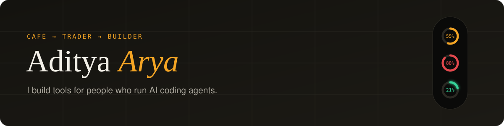

I ran a café, then traded the markets. These days I run AI coding agents all day, on my laptop and a VPS, and build the tools I wish they came with.

**Working on now**

- **[Agent Notch](https://adityarya.dev/agent-notch/)**: a slim notch on the edge of your screen showing live quota for Claude Code, Codex, Gemini, Cursor, Grok and OpenCode, so you see the limit coming. Windows, macOS in progress.
- **[MindSync](https://github.com/adityarya24/mindsync-ai)**: lets your coding agents share memory and hand work to each other when one runs out of quota. Runs locally on the subscriptions you already pay for.
- **[VedPatrika](https://vedpatrika.in)**: a Hindi-first Vedic astrology product. The math runs on my own open-source engine, [astro-skill](https://github.com/adityarya24/astro-skill).

**Other things I've built**

- [gws-marketing](https://github.com/adityarya24/gws-marketing): an MCP server that gives agents Search Console, GA4 and Gmail, with drafts you approve before anything sends
- [trading-mcp-server](https://github.com/adityarya24/trading-mcp-server): Indian market data, morning briefs and a trade journal for an AI analyst
- [file-organizer](https://github.com/adityarya24/file-organizer): keeps Downloads and Desktop tidy in the background, with undo

**Say hi**: [adityarya.dev](https://adityarya.dev) · [@adityarya_ai](https://x.com/adityarya_ai) · [LinkedIn](https://www.linkedin.com/in/adityaryawork/) · [book a call](https://cal.com/adityarya24/project-discussion)
